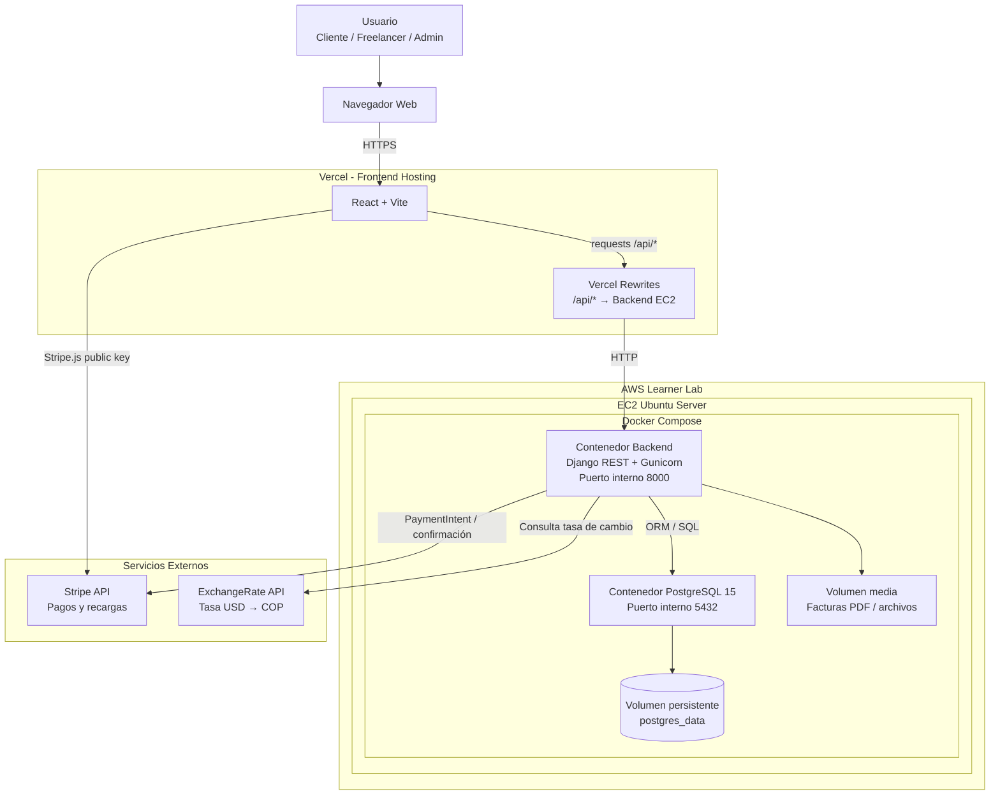
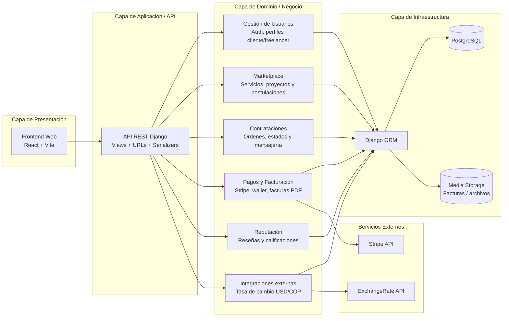
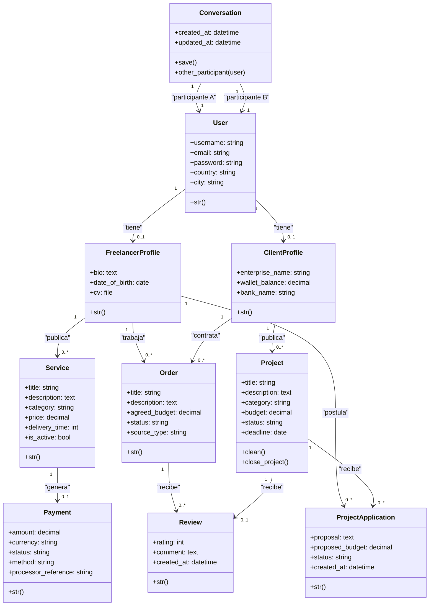
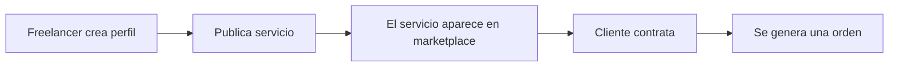
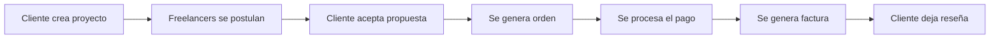
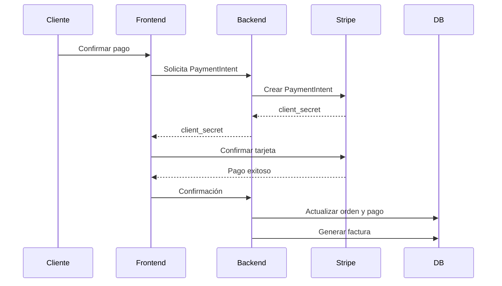
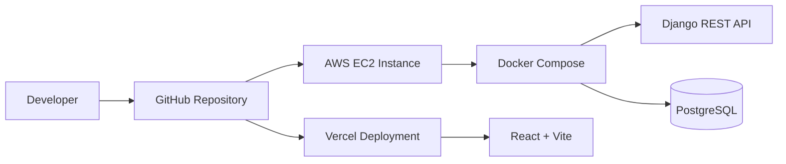
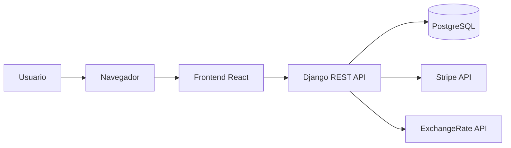
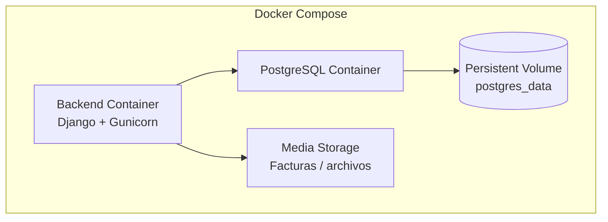

# WorkNexus

Work Nexus es un marketplace freelance moderno construido con **React + Django REST + PostgreSQL**, diseñado para conectar clientes y freelancers mediante servicios, proyectos, pagos integrados, facturación, reseñas y gestión de órdenes.

## Descripción general
WorkNexus es una plataforma SaaS tipo marketplace enfocada en:
- Publicación de servicios freelance.
- Contratación de freelancers.
- Gestión de proyectos.
- Postulación de profesionales.
- Pagos integrados con Stripe.
- Wallet interno.
- Facturación PDF.
- Sistema de reseñas.
- Mensajería entre usuarios.

La arquitectura fue diseñada para ser **escalable, modular, contenerizada, preparada para despliegue cloud y compatible con integraciones externas**.

  

## Problema que resuelve

El sistema busca reducir la informalidad en la contratación de servicios freelance, ofreciendo trazabilidad, gestión estructurada del trabajo, pagos registrados, reputación verificable y comunicación entre cliente y profesional.

## Actores del sistema
| Actor | Responsabilidad |
| :--- | :--- |
| **Cliente** | Publica proyectos, contrata servicios, realiza pagos, gestiona órdenes y califica freelancers. |
| **Freelancer** | Publica servicios, se postula a proyectos, ejecuta trabajos, recibe pagos y califica clientes. |
| **Administrador** | Supervisa usuarios, proyectos, reseñas, pagos y actividad general del sistema. |

## Funcionalidades implementadas
| Funcionalidad | Descripción |
| :--- | :--- |
| **Autenticación** | Registro, login, perfiles y roles de usuario. |
| **Marketplace de servicios** | Publicación, búsqueda y contratación de servicios freelance. |
| **Gestión de proyectos** | Clientes publican proyectos y freelancers se postulan. |
| **Órdenes de trabajo** | Seguimiento del estado de una contratación. |
| **Pagos** | Integración con Stripe mediante `PaymentIntent`. |
| **Wallet interno** | Gestión de saldo asociado a clientes. |
| **Facturación PDF** | Generación de comprobantes asociados a pagos. |
| **Reseñas** | Calificación entre clientes y freelancers. |
| **Mensajería** | Comunicación interna entre usuarios. |
| **Conversión monetaria** | Consulta de tasa USD/COP mediante API externa. |
---

  

# Arquitectura del Sistema

## Arquitectura de despliegue

## Arquitectura por capas

  

## Modelo de dominio

  

---

  

# Tecnologías utilizadas

## Frontend
| Tecnología | Uso |
| :--- | :--- |
| **React 18** | UI principal |
| **TypeScript** | Tipado estático |
| **Vite** | Bundler y entorno de desarrollo |
| **Tailwind CSS** | Estilos |
| **React Router** | Navegación SPA |
| **React Query** | Manejo de estado remoto |
| **Stripe JS** | Integración de pagos |
| **Framer Motion** | Animaciones |
| **Zod** | Validaciones |
| **React Hook Form** | Manejo de formularios | 

## Backend
| Tecnología | Uso |
| :--- | :--- |
| **Django** | Framework backend |
| **Django REST Framework** | API REST |
| **PostgreSQL** | Base de datos |
| **Gunicorn** | Servidor WSGI |
| **Stripe SDK** | Integración de pagos |
| **Psycopg2** | Driver PostgreSQL |
| **WhiteNoise** | Archivos estáticos |
| **Django CORS Headers** | Manejo CORS |
| **Python Dotenv** | Variables de entorno |
## Infraestructura
| Tecnología | Uso |
| :--- | :--- |
| **Docker** | Contenerización |
| **Docker Compose** | Orquestación |
| **AWS EC2** | Hosting backend |
| **Vercel** | Hosting frontend |
| **PostgreSQL Volume** | Persistencia de datos |
---

  

# Módulos del Backend
| Módulo | Responsabilidad | Funcionalidades |
| :--- | :--- | :--- |
| **Authentication** | Gestión de usuarios y autenticación | Registro, login, JWT/Auth, perfiles cliente/freelancer, permisos y roles |
| **Services** | Administración de servicios freelance | Crear, editar, listar, filtrar y publicar servicios |
| **Projects** | Gestión de proyectos y postulaciones | Publicación de proyectos, postulaciones, propuestas y cierre de proyectos |
| **Orders** | Gestión del flujo de trabajo | Creación de órdenes, estados de trabajo, seguimiento cliente ↔ freelancer |
| **Payments** | Procesamiento de pagos | Stripe `PaymentIntent`, confirmación de pagos, wallet interno y conversión monetaria |
| **Facturas** | Facturación y comprobantes | Generación de PDFs, historial de facturación y asociación factura ↔ pago |
| **Messaging** | Comunicación interna | Conversaciones, mensajería entre usuarios y flujo de comunicación |
| **Reviews** | Sistema de reputación | Reseñas, ratings, estadísticas y promedio de calificaciones |
---

  

# Flujo de Negocio

  

## Publicación de servicios

  

  

## Publicación de proyectos

  

  

## Procesamiento de pagos

  

  

---

  

# Infraestructura y Despliegue

  

## Pipeline de despliegue

  

  

## Flujo de ejecución en producción

  

  

## Contenedores y persistencia

  

  

## Estrategia de infraestructura
| Componente | Tecnología | Responsabilidad |
| :--- | :--- | :--- |
| **Frontend Hosting** | Vercel | Hosting del cliente React |
| **Backend Hosting** | AWS EC2 | Ejecución de API Django |
| **Orquestación** | Docker Compose | Gestión de contenedores |
| **Base de Datos** | PostgreSQL 15 | Persistencia de datos |
| **Persistencia** | Docker Volumes | Almacenamiento permanente |
| **Pagos** | Stripe API | Procesamiento de pagos |
| **Conversión Monetaria** | ExchangeRate API | Conversión USD/COP |
---

  

# Buenas prácticas aplicadas
- Separación por capas.
- Apps Django modulares.
- Variables de entorno en `.env`.
- Uso de Docker para consistencia.
- PostgreSQL para persistencia robusta.
- React Query para manejo eficiente de estado remoto.
- Stripe para pagos seguros.
- Arquitectura preparada para escalar.
- Aplicación de principios DRY y separación de responsabilidades.

---
# Estado del proyecto
- Arquitectura definida.
- Backend modular.
- Frontend SPA funcional.
- Integración Stripe.
- PostgreSQL + Docker.
- Facturación PDF.
- Marketplace funcional.
---

# Equipo

Proyecto académico desarrollado como plataforma SaaS de marketplace freelance por:
- José Benjamín Vega Ramírez
- Anna Sofía Giraldo Carvajal
